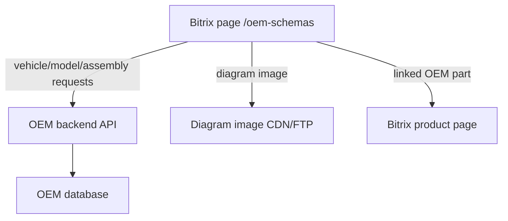

# Backend API Contract

This document describes the future backend API for the OEM Schemas Catalog. The API is intentionally independent from Bitrix internals, but it returns Bitrix product links when available.

Base path proposal:

```text
/api/oem
```

## Response Envelope

Use a consistent response envelope:

```json
{
  "data": {},
  "meta": {
    "request_id": "string",
    "generated_at": "2026-06-17T12:00:00Z"
  }
}
```

For lists:

```json
{
  "data": [],
  "pagination": {
    "limit": 50,
    "offset": 0,
    "total": 120
  },
  "meta": {}
}
```

Errors:

```json
{
  "error": {
    "code": "not_found",
    "message": "Assembly not found"
  },
  "meta": {
    "request_id": "string"
  }
}
```

## Navigation Endpoints

Frontend navigation order:

```text
vehicle type -> brand -> year -> model -> variant -> assembly -> diagram
```

### `GET /api/oem/vehicle-types`

Returns first-scope vehicle types.

Example response:

```json
{
  "data": [
    {"id": 1, "code": "motorcycle", "name": "Motorcycle"},
    {"id": 2, "code": "atv", "name": "ATV"},
    {"id": 3, "code": "ssv", "name": "SSV / Side-by-side"},
    {"id": 4, "code": "snowmobile", "name": "Snowmobile"},
    {"id": 5, "code": "jetski", "name": "Jet ski / PWC"},
    {"id": 6, "code": "outboard", "name": "Outboard motor"}
  ],
  "meta": {}
}
```

### `GET /api/oem/brands`

Query params:

- `vehicle_type`: optional code
- `source`: optional source code

Example:

```text
GET /api/oem/brands?vehicle_type=motorcycle
```

Response item:

```json
{
  "id": 10,
  "name": "Yamaha",
  "aliases": ["Yamaha Motor"],
  "model_count": 420
}
```

### `GET /api/oem/years`

Returns years available for the selected vehicle type and brand. The frontend should request models only after the user has selected a year.

Query params:

- `vehicle_type`: required
- `brand_id`: required

Example:

```text
GET /api/oem/years?vehicle_type=motorcycle&brand_id=10
```

Response item:

```json
{
  "year": 2025,
  "model_count": 37,
  "variant_count": 82
}
```

### `GET /api/oem/models`

Query params:

- `vehicle_type`: required
- `brand_id`: required
- `year`: required for frontend navigation
- `q`: optional search string
- `limit`, `offset`

Response item:

```json
{
  "id": 100,
  "brand_id": 10,
  "vehicle_type": "motorcycle",
  "name": "MT-10",
  "aliases": ["FZ10/ MTN1000", "MTN1000", "FZ-10"],
  "years": [2016, 2017],
  "variant_count": 28
}
```

### `GET /api/oem/variants`

Query params:

- `model_id`: required
- `year`: optional
- `region`: optional
- `region_code`: optional
- `color_code`: optional
- `source`: optional

Response item:

```json
{
  "id": 500,
  "model_id": 100,
  "year_from": 2016,
  "year_to": 2016,
  "market_name": "MT-10",
  "source_designation": "MTN1000",
  "model_code": "B671",
  "region": "Европа",
  "region_code": "050",
  "color_code": "B",
  "color_name": "DEEP PURPLISH BLUE METALLIC C",
  "engine_cc": 1000,
  "sources": [
    {
      "source": "megazip",
      "source_node_id": 9001,
      "url": "https://www.megazip.ru/..."
    }
  ]
}
```

### `GET /api/oem/assemblies`

Query params:

- `variant_id`: required
- `q`: optional assembly-name search
- `source`: optional

Response item:

```json
{
  "id": 700,
  "variant_id": 500,
  "title": "Картер двигателя",
  "normalized_title": "crankcase",
  "diagram_count": 1,
  "part_count": 33,
  "thumbnail_url": "/upload/oem/megazip/Yamaha/...",
  "source": {
    "code": "megazip",
    "source_node_id": 9100,
    "url": "https://www.megazip.ru/..."
  }
}
```

## Diagram Endpoint

### `GET /api/oem/diagrams/{assembly_id}`

Returns the frontend-ready diagram payload.

Example response:

```json
{
  "data": {
    "assembly": {
      "id": 700,
      "title": "Картер двигателя",
      "variant_id": 500
    },
    "diagram": {
      "id": 800,
      "image_url": "https://static.motor-force.ru/oem/megazip/Yamaha/abc.png",
      "width": 560,
      "height": 773
    },
    "hotspots": [
      {
        "id": 1,
        "shape": "rect",
        "coords": [186, 292, 204, 310],
        "x": 186,
        "y": 292,
        "width": 18,
        "height": 18,
        "ref": "1",
        "assembly_part_ids": [10001]
      }
    ],
    "parts": [
      {
        "assembly_part_id": 10001,
        "ref": "1",
        "quantity": 1,
        "row_kind": "original",
        "part": {
          "id": 20001,
          "name": "Картер",
          "part_number": "B67-15100-09-00",
          "normalized_part_number": "B67151000900",
          "manufacturer": "Yamaha"
        },
        "bitrix": {
          "linked": false,
          "product_id": null,
          "product_url": null
        },
        "offer": {
          "price": null,
          "currency": "RUB",
          "availability": null
        },
        "replacements": [
          {
            "part_number": "B67-15100-08-00",
            "name": "Картер",
            "bitrix": {"linked": false}
          }
        ]
      }
    ],
    "source": {
      "code": "megazip",
      "url": "https://www.megazip.ru/...",
      "source_node_id": 9100
    }
  },
  "meta": {}
}
```

Frontend behavior:

- Render `diagram.image_url`.
- Overlay `hotspots`.
- On hotspot click, highlight all `parts` with matching `assembly_part_ids`.
- If `bitrix.linked = true`, show add/open product actions.
- If no Bitrix product exists, show OEM/name/quantity and a request action.

## Part Search

### `GET /api/oem/parts/search`

Query params:

- `q`: OEM number or name
- `vehicle_type`: optional
- `brand_id`: optional
- `limit`, `offset`

Search should match:

- exact display OEM
- normalized OEM
- part aliases
- part names

Response item:

```json
{
  "id": 20001,
  "part_number": "B67-15100-09-00",
  "normalized_part_number": "B67151000900",
  "name": "Картер",
  "manufacturer": "Yamaha",
  "used_in_count": 4,
  "bitrix": {
    "linked": true,
    "product_id": 12345,
    "product_url": "/catalog/..."
  },
  "offer": {
    "price": 12345.00,
    "currency": "RUB",
    "availability": "in_stock"
  }
}
```

### `GET /api/oem/parts/{part_id}`

Returns part details and usage.

Response includes:

- canonical part
- aliases
- Bitrix links
- offers
- replacements/supersessions
- assemblies where used

## Admin / Import Endpoints

These should be protected and not exposed publicly.

### `POST /api/oem/admin/import-runs`

Starts a controlled import run.

Request:

```json
{
  "source": "megazip",
  "mode": "pilot",
  "vehicle_types": ["motorcycle"],
  "brands": ["Yamaha"],
  "max_pages": 50
}
```

### `GET /api/oem/admin/import-runs/{run_id}`

Returns status, counts, errors, and current source node.

### `POST /api/oem/admin/bitrix-link/rebuild`

Rebuilds part-to-Bitrix links from current Bitrix catalog data.

## Bitrix Page Integration

Suggested future Bitrix page:

```text
/oem-schemas/
```

Frontend flow:



Implementation options:

1. Bitrix page renders a JS app and calls `/api/oem`.
2. Backend can be a separate service behind nginx.
3. Bitrix product links are returned from `part_bitrix_links`.

## Caching

Recommended cache layers:

- navigation lists: 1 hour
- diagram payloads: 1 day, invalidated by import run
- part search: 15 minutes
- Bitrix offers: based on product price update schedule

## Security

- Public endpoints are read-only.
- Admin import endpoints require authentication.
- Do not expose raw source snapshots publicly.
- Do not expose source app keys in frontend payloads.
- Use backend-generated public image URLs, not source CDN URLs.

## Versioning

Expose API version in response metadata:

```json
{
  "meta": {
    "api_version": "v1"
  }
}
```

Breaking changes should use `/api/oem/v2` or compatible response extensions.
