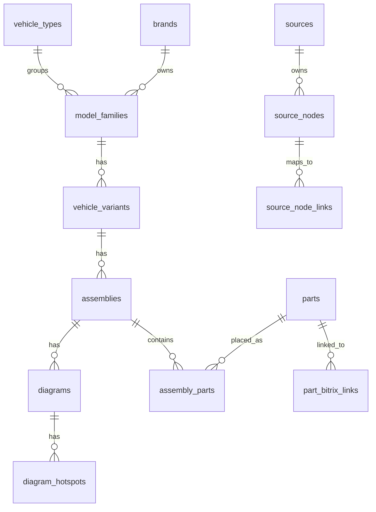

# Database Model

The database separates canonical catalog data from source-specific data. This is important because the same vehicle can be represented differently by RE Motors/ARI and Megazip.

## Design Goals

- Preserve source identity for every imported object.
- Normalize navigation data for one frontend.
- Avoid destructive auto-merge of ambiguous models.
- Store local diagram assets independently from source URLs.
- Store our own prices separately from source price snapshots.
- Keep enough raw data to reparse without crawling the source again.

## Entity Overview

Frontend navigation uses `year` before model:

```text
vehicle_types -> brands -> years -> model_families -> vehicle_variants -> assemblies -> diagrams
```

`years` is a derived navigation level, not a separate canonical table. It is computed from `vehicle_variants.year_from/year_to` for the selected vehicle type and brand, then models are filtered to those available in the selected year.



## Canonical Tables

### `vehicle_types`

Canonical vehicle categories used by frontend filters.

Initial codes:

- `motorcycle`
- `atv`
- `ssv`
- `snowmobile`
- `jetski`
- `outboard`

### `brands`

Canonical manufacturer/brand record.

Examples:

- `Yamaha`
- `KTM`
- `Husqvarna`
- `Can-Am`
- `Sea-Doo`
- `Ski-Doo`
- `Polaris`
- `Kawasaki`
- `Honda`
- `Suzuki`

### `brand_aliases`

Maps source display names to canonical brands.

Examples:

| Alias | Canonical |
| --- | --- |
| `Husqvarna Motorcycle` | `Husqvarna` |
| `Bombardier` | `BRP` or product-specific brand |
| `BRP_SEA` | `Sea-Doo` |
| `BRP_SKI` | `Ski-Doo` |

### `model_families`

Canonical model group, independent of year and region.

Examples:

- `MT-10`
- `FZ10 / MTN1000`
- `125 SX`
- `FZ1`

Do not use source display names as canonical ids without alias review.

### `model_aliases`

Stores source names and alternate names.

Examples:

- `FZ10/ MTN1000`
- `MTN1000`
- `FZ-10`
- `MT-10`
- `125 SX CHASSIS`
- `125 SX/XC ENGINE`

### `vehicle_variants`

Concrete vehicle or catalog variant.

Common fields:

- year
- model code
- region
- region code
- color code
- color name
- engine displacement
- market model name
- source designation

For ARI, `CHASSIS` and `ENGINE` nodes can be separate source variants or variant sections. Keep the raw source node and use canonical `variant_section` when needed.

## Source Provenance Tables

### `sources`

Defines each source system.

Examples:

- `remotors_ari`
- `megazip`

Store base URL, locale, default currency, and parser type.

### `source_nodes`

Universal source hierarchy node.

Use this table for:

- Megazip category pages
- Megazip brand/model/variant/assembly URLs
- ARI brand/year/model/assembly nodes

Important fields:

- source id
- parent source node id
- node type
- title
- source URL
- external id
- ARI `arib`
- ARI `aria`
- ARI `slug`
- Megazip URL path
- raw payload hash
- last seen timestamp

### `source_node_links`

Maps source nodes to canonical tables.

Examples:

- Megazip `FZ10/ MTN1000` model page -> `model_families.id`
- ARI `125 SX CHASSIS - 2025` -> `vehicle_variants.id`
- Megazip assembly URL -> `assemblies.id`

This prevents source ids from leaking into canonical primary keys.

## Diagram Tables

### `assemblies`

Canonical or semi-canonical group of parts for one variant.

Examples:

- `AIR FILTER`
- `Картер двигателя`
- `FRONT BRAKE CALIPER`
- `Передний тормоз`

Store both source title and normalized title. Later we can map names between languages.

### `diagrams`

One or more images for an assembly.

Fields:

- original image URL
- local path
- future public URL
- width
- height
- checksum
- mime type
- source image id

### `diagram_hotspots`

Clickable regions on a diagram image.

Fields:

- `shape`: rect, circle, poly, point, unknown
- `raw_coords`: source coordinate string or raw style
- normalized x/y/w/h
- normalized polygon JSON if needed
- source reference id
- part ref label
- source items list id
- link to `assembly_parts` when resolved

## Parts Tables

### `parts`

Canonical OEM part record.

Fields:

- manufacturer brand
- OEM number as displayed
- normalized OEM number
- primary name
- optional description

Normalization should preserve original formatting:

```text
B67-15100-09-00 -> B67151000900
A46006001000EB -> A46006001000EB
```

### `part_aliases`

Additional OEM numbers or names for the same part.

Use for:

- supersessions
- source-specific part names
- translated names

### `assembly_parts`

Placement of a part within an assembly.

Fields:

- assembly id
- part id
- ref number
- quantity
- source row id
- source items list id
- row kind: original, replacement, note
- notes

### `part_relations`

Relationship between parts.

Initial relation types:

- `replacement`
- `supersession`
- `alternative`
- `included_with`

Megazip rows after `замена` / `замены` should become replacement relations.

## Pricing And Bitrix Tables

### `part_bitrix_links`

Links canonical OEM parts to Bitrix products.

Fields:

- part id
- Bitrix product id
- iblock id
- XML ID
- URL
- match type: exact OEM, normalized OEM, manual, alias
- confidence

### `part_offers`

Our own price/availability layer.

This should be populated from Bitrix or internal pricing, not from source pages.

Fields:

- part id
- price
- currency
- availability
- stock quantity
- supplier
- source: bitrix, manual, import
- updated at

### `source_price_snapshots`

Optional diagnostic table for source prices.

Use only if we need to compare market prices or debug parser results. Do not use it for frontend selling prices.

## Raw Data Tables

### `raw_snapshots`

Stores raw HTML/JSON fragments, response headers, and parser version.

Use this for reproducibility:

- exact source URL
- content hash
- captured at
- parser version
- compressed raw content path or payload

## Merge Strategy

1. Always import source nodes first.
2. Create canonical entities with conservative matching.
3. If a source model cannot be safely matched, create a new canonical candidate and mark it for review.
4. Never delete source nodes during normal updates; mark as not seen or inactive.
5. Keep aliases reviewable.

## Indexing Notes

Important indexes:

- source + external id
- source + URL path
- normalized OEM number
- brand + vehicle type + canonical model name
- variant by model/year/region/model code
- assembly by variant + normalized title
- hotspot by diagram + source items list id

## Storage Of Images

Recommended local structure:

```text
storage/oem-diagrams/{source_code}/{brand}/{source_node_id}/{checksum}.{ext}
```

The database should not assume final FTP/CDN location. Use `local_path` first and fill `public_url` after publishing.
