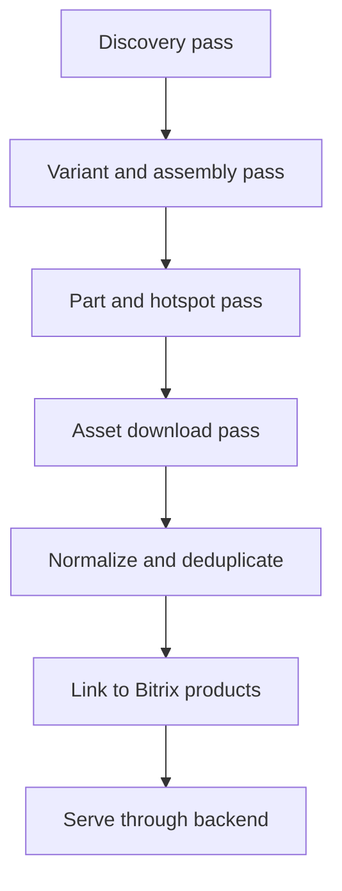

# Import Pipeline

The import pipeline must be incremental, auditable, and safe for source websites. The first implementation should import a small pilot subset before any full crawl.

## Pipeline Stages



## Stage 1: Discovery Pass

Purpose: collect source hierarchy without downloading every diagram.

### Megazip

Input roots:

```text
/zapchasti-dlya-motocyklov
/zapchasti-dlya-kvadrocyklov
/zapchasti-dlya-snegohodov
/zapchasti-dlya-gidrociklov
/zapchasti-dlya-lodochnyh-motorov
```

Collect:

- vehicle type
- brand URLs
- model family URLs
- visible model aliases
- filters if present

Store:

- `oem_source_nodes`
- `oem_raw_snapshots`
- canonical candidates for brand/model family

### RE Motors / ARI

Input roots:

```text
https://remotors.fi/eng/partfinder?aribrand=KTM
```

Collect:

- ARI brands (`arib`)
- available years
- model/source nodes under each year

Store:

- `arib`
- `aria`
- node title
- source browser hash if available
- raw DOM/response snapshot

## Stage 2: Variant And Assembly Pass

Purpose: collect concrete vehicle variants and assembly list.

### Megazip

For each model family:

1. Open variant list page.
2. Extract concrete variants and metadata:
   - year
   - model code
   - region
   - region code
   - color code
   - color name
   - engine cc
   - market model
3. Open concrete variant page.
4. Extract assembly URLs and names.

### RE Motors / ARI

For each ARI model/source node:

1. Open the model node.
2. Extract assembly nodes:
   - title
   - `aria`
   - `slug`
   - thumbnail image URL
3. Decide whether the source node is:
   - a concrete vehicle variant
   - a section of a variant, for example `CHASSIS` or `ENGINE`

Store ambiguous cases as source variants and mark for normalization review.

## Stage 3: Part And Hotspot Pass

Purpose: parse final assembly pages.

### Common Output

For each assembly:

- diagram image URL
- diagram dimensions where available
- hotspot coordinates
- ref labels
- OEM part numbers
- part names
- quantities
- replacement/supersession rows
- source row ids
- raw JSON/HTML snippets

### Megazip

Extract:

- `img#items_list_image` or equivalent diagram image
- `map area` coordinates
- `data-items-list-id`
- table rows
- row JSON attributes

Map:

```text
map area data-items-list-id -> row JSON itemslist_id -> assembly_part
```

### RE Motors / ARI

Extract:

- diagram image URL
- `.ariHotSpot` elements
- CSS `top`, `left`, `width`, `height`
- raw `coords` if present
- visible part rows
- tooltip/detail data if required for hidden fields

Map:

```text
hotspot ref/source id -> part row ref -> assembly_part
```

If the DOM does not expose a complete mapping, capture raw payload and keep hotspot unresolved until direct ARI endpoint research is complete.

## Stage 4: Asset Download Pass

Purpose: locally store diagram images.

Local path template:

```text
storage/oem-diagrams/{source_code}/{brand}/{source_node_id}/{checksum}.{ext}
```

Steps:

1. Download image using a polite request rate.
2. Detect MIME type and extension.
3. Compute SHA-256 checksum.
4. Store width and height.
5. Fill `oem_diagrams.local_path`.
6. Later, after FTP/CDN upload, fill `public_url`.

Do not hotlink source images in production frontend.

## Stage 5: Normalize And Deduplicate

Normalize:

- brand names
- vehicle type
- model family names
- OEM part numbers
- assembly group names

Part number normalization:

```text
uppercase
remove spaces
remove hyphen and slash for matching key
keep original display value
```

Examples:

```text
B67-15100-09-00 -> B67151000900
995-30100-14-00 -> 995301001400
A46006001000EB -> A46006001000EB
```

Dedup rules:

1. Brand aliases must be explicit or reviewed.
2. Model alias matches can be suggested automatically but should not be blindly merged.
3. Parts can be matched by normalized OEM number with high confidence.
4. Assemblies should be normalized by title and variant, but source-specific names remain stored.

## Stage 6: Bitrix Link Pass

Purpose: connect OEM parts to Bitrix products.

Inputs:

- normalized OEM part number
- Bitrix product properties
- Bitrix XML ID / product ID
- existing product URLs

Match types:

- `exact_oem`
- `normalized_oem`
- `alias`
- `manual`

The frontend should display:

- linked Bitrix product when match exists
- fallback OEM part row when no product exists yet
- internal price from `oem_part_offers`, not source price

## Stage 7: Updates

Use incremental updates:

- update source node `last_seen_at`
- mark missing nodes inactive after repeated misses
- re-download images only when URL/hash changes
- keep historical raw snapshots for parser changes
- refresh Bitrix prices independently from source parsing

## Pilot Import

Before full import, use two sample paths:

### ARI

```text
RE Motors -> KTM -> 2025 -> 125 SX CHASSIS - 2025 -> AIR FILTER
```

### Megazip

```text
Megazip -> motorcycle -> Yamaha -> FZ10/ MTN1000 -> MT-10 2016 Europe 050 B -> Картер двигателя
```

The pilot must validate:

- source hierarchy storage
- diagram image download
- hotspot extraction
- part row extraction
- replacement rows
- source provenance
- Bitrix link placeholder

## Rate Limits And Safety

Recommended initial settings:

- 1 concurrent page per source
- 1-3 seconds delay between final assembly pages
- exponential backoff on 429/5xx
- maximum crawl budget per run
- resume from last source node

Never run a full-source crawl until the pilot import is reviewed.

## Parser Versioning

Every parser run should record:

- parser version
- source code
- started/finished timestamps
- counts by entity
- failed URLs/nodes
- raw snapshot hash

This makes future parser changes auditable.
